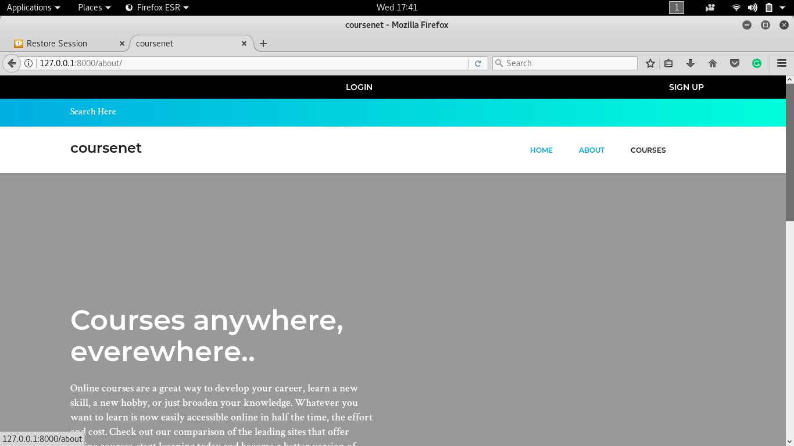
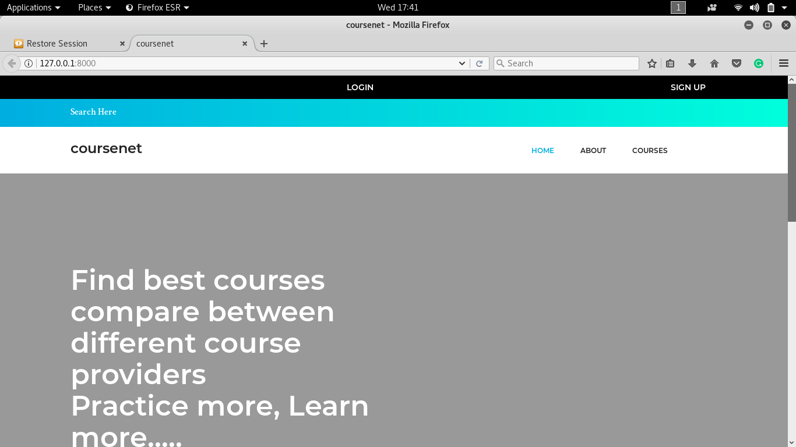
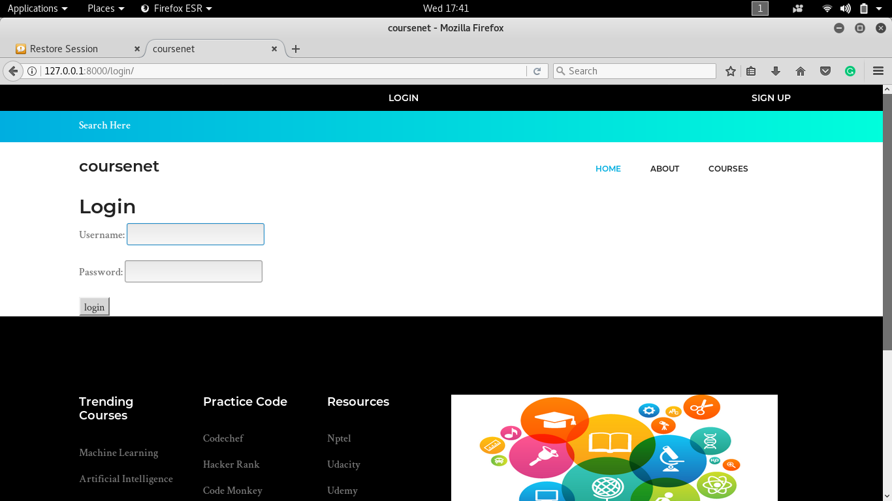
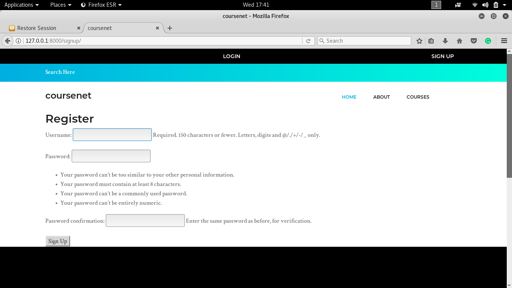
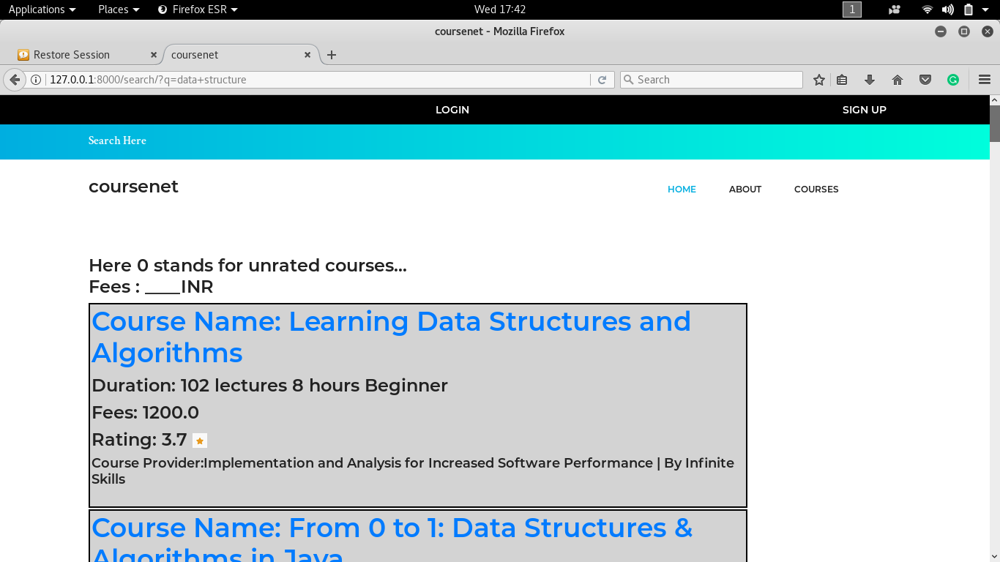
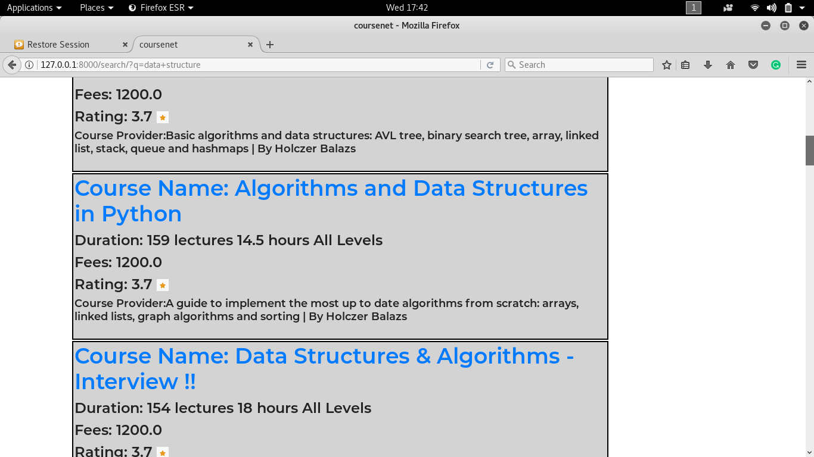
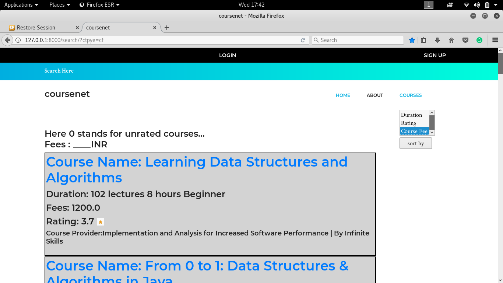

# Online-Course-Comparision-Web-Application
• Compare various online available courses based on there ratings and prices.And also provide filter to refine the data shown to user.

• Make use of Data Scraping to gather course information from various online course providers(is.e Udemy,Udacity,Coursera etc.). 

• Front end development using HTML and CSS,Back end using Python and Django web framework

## About

## Home

 

## Login

 

## Sign Up

 

## Result for searching Data Structure Course

 

 

## Sorting the Result

 
